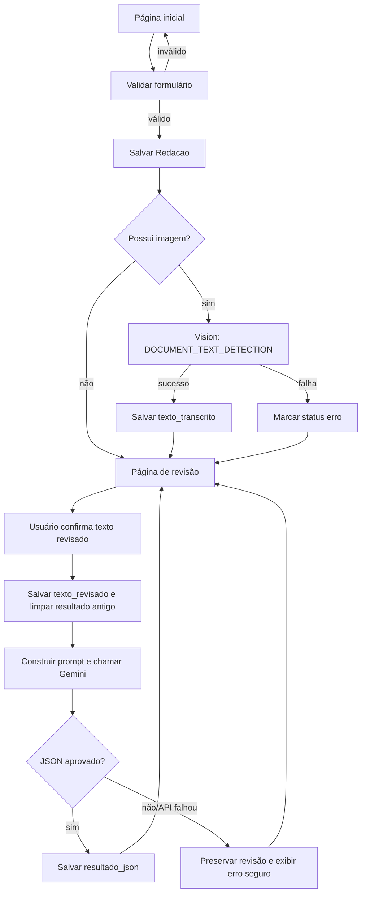

# Corretor de Redações ENEM

Protótipo Django para receber uma redação digitada ou em imagem, extrair texto com Google Cloud Vision, permitir revisão humana e solicitar ao Gemini uma avaliação estruturada segundo as cinco competências do ENEM.

O resultado é pedagógico e não substitui a correção oficial do Inep.

## Funcionalidades

- envio de tema, texto e/ou imagem;
- validação de tipo e tamanho da imagem (até 10 MB);
- OCR com `DOCUMENT_TEXT_DETECTION` do Google Cloud Vision;
- preservação separada do texto original, OCR e texto revisado;
- revisão humana antes da avaliação;
- prompt protegido contra prompt injection e orientado às cinco competências;
- resposta Gemini em JSON, validada localmente antes de ser salva;
- mensagens seguras para erros de credenciais, cota, API e resposta;
- painel administrativo do Django;
- interface responsiva com Bootstrap 5;
- suíte com 58 testes e mocks dos serviços externos.

## Arquitetura

O projeto mantém responsabilidades separadas:

- **templates e arquivos estáticos:** apresentação e interações locais;
- **forms:** validação da entrada HTTP;
- **views:** coordenação do fluxo, mensagens e redirecionamentos;
- **model:** regras e persistência da redação;
- **services:** integrações com Vision e Gemini e construção/validação do prompt;
- **tests:** comportamento das camadas e falhas externas sem consumo real de API.

As views não conhecem detalhes dos SDKs. O Vision recebe uma imagem e devolve texto; o Gemini recebe tema e texto revisado e só devolve um dicionário depois da validação do contrato.

## Estrutura do projeto

```text
Corretor-de-redacao-ENEM/
├── config/
│   ├── asgi.py                 # entrada ASGI
│   ├── settings.py             # configuração Django e ambiente
│   ├── urls.py                 # rotas globais
│   └── wsgi.py                 # entrada WSGI
├── media/
│   └── .gitkeep                # mantém a pasta de uploads no Git
├── redacoes/
│   ├── migrations/
│   │   └── 0001_initial.py     # schema inicial da redação
│   ├── services/
│   │   ├── gemini_service.py   # cliente Gemini e erros seguros
│   │   ├── prompt_builder.py   # prompt e validação do JSON
│   │   └── vision_service.py   # OCR com Google Vision
│   ├── templates/redacoes/
│   │   ├── inicio.html         # envio da redação
│   │   └── revisao.html        # revisão da transcrição
│   ├── admin.py                # painel administrativo
│   ├── apps.py                 # configuração da aplicação
│   ├── forms.py                # formulários de envio e revisão
│   ├── models.py               # entidade Redacao
│   ├── test_gemini_service.py  # testes isolados do Gemini
│   ├── test_prompt_builder.py  # testes do prompt e contrato
│   ├── tests.py                # models, forms, views e Vision
│   ├── urls.py                 # rotas da aplicação
│   ├── validators.py           # limite de upload
│   └── views.py                # fluxo HTTP
├── static/
│   ├── css/app.css             # estilos próprios
│   └── js/redacao-form.js      # prévia e contador local
├── templates/
│   └── base.html               # layout, navbar e mensagens
├── .env.example                # referência de configuração
├── .gitignore                  # arquivos locais ignorados
├── manage.py                   # comandos Django
└── requirements.txt            # dependências fixadas
```

## Fluxo da aplicação



## Modelo `Redacao`

- `tema`: proposta da redação, entre 5 e 255 caracteres;
- `imagem`: upload opcional armazenado por ano e mês;
- `texto_original`: conteúdo digitado no envio;
- `texto_transcrito`: retorno bruto e imutável do OCR;
- `texto_revisado`: versão confirmada pelo usuário;
- `resultado_json`: avaliação estruturada validada;
- `status`: `enviada`, `processando`, `concluida` ou `erro`;
- `criada_em` e `atualizada_em`: auditoria temporal automática.

É obrigatório informar imagem ou texto original.

## Instalação local

Requer Python 3.11 ou superior e acesso opcional às APIs Google para executar o fluxo completo.

No PowerShell:

```powershell
python -m venv .venv
.\.venv\Scripts\Activate.ps1
python -m pip install --upgrade pip
pip install -r requirements.txt
Copy-Item .env.example .env
python manage.py migrate
python manage.py createsuperuser
python manage.py runserver
```

Acesse:

- aplicação: `http://127.0.0.1:8000/`
- administração: `http://127.0.0.1:8000/admin/`

## Configuração do ambiente

Edite `.env`:

```env
DJANGO_SECRET_KEY=gere-uma-chave-longa-e-exclusiva
DJANGO_DEBUG=True
DJANGO_ALLOWED_HOSTS=localhost,127.0.0.1
DJANGO_CSRF_TRUSTED_ORIGINS=

GOOGLE_APPLICATION_CREDENTIALS=credentials/google-vision.json
GEMINI_API_KEY=sua-chave
GEMINI_MODEL=gemini-3.6-flash
```

O `.env` e os JSONs em `credentials/` são ignorados pelo Git.

### Google Cloud Vision

1. Crie ou selecione um projeto Google Cloud.
2. Habilite a Cloud Vision API e o faturamento.
3. Conceda à identidade apenas a permissão necessária para usar a API.
4. Prefira Application Default Credentials ou identidade associada ao ambiente.
5. Em desenvolvimento, se usar um JSON, mantenha-o fora do Git e informe o caminho em `GOOGLE_APPLICATION_CREDENTIALS`.

### Gemini

Configure `GEMINI_API_KEY`. O modelo é lido de `GEMINI_MODEL`, permitindo troca sem alteração no código. O serviço usa JSON, temperatura zero, uma candidata e timeout de 60 segundos.

## Validação da avaliação

Uma resposta externa só é persistida quando cumpre todo o contrato:

- JSON parseável e sem Markdown;
- conjunto exato de campos e versão de schema compatível;
- exatamente cinco competências, na ordem e com nomes esperados;
- notas somente em `0`, `40`, `80`, `120`, `160` ou `200`;
- total igual à soma das cinco notas;
- competência 5 igual a zero quando há desrespeito aos direitos humanos;
- citações existentes literalmente no texto revisado;
- campos obrigatórios, tipos e enumerações válidos;
- avaliação impossível com motivo, notas nulas e total nulo.

Os erros têm código estável e caminho do campo quando aplicável. A resposta bruta, a redação e as credenciais não são gravadas em logs.

## Testes

Os SDKs externos são substituídos por mocks. Portanto, os testes não consomem cota nem dependem de rede ou credenciais.

```powershell
python manage.py test
python manage.py check
python manage.py makemigrations --check --dry-run
```

A cobertura inclui models, formulários, views, OCR, Gemini, prompt, validações, mensagens, redirecionamentos e cenários de erro.

## Decisões da refatoração

- as views usam retornos antecipados e funções privadas para reduzir aninhamento;
- processamento de OCR e avaliação ficaram em rotinas distintas;
- a revisão é salva antes da API, evitando perda do trabalho humano;
- resultados antigos são limpos antes de avaliar texto alterado;
- leitura de booleanos e listas do ambiente foi centralizada;
- CSS sem uso foi removido;
- URLs temporárias da pré-visualização são liberadas pelo navegador;
- SDKs continuam isolados em `services/`;
- nenhuma alteração de banco foi necessária.

## Checklist para produção

### Django e segurança

- [ ] gerar `DJANGO_SECRET_KEY` forte e exclusiva;
- [ ] definir `DJANGO_DEBUG=False`;
- [ ] preencher `DJANGO_ALLOWED_HOSTS` com os domínios reais;
- [ ] preencher `DJANGO_CSRF_TRUSTED_ORIGINS` com origens HTTPS;
- [ ] ativar `DJANGO_SECURE_SSL_REDIRECT=True` atrás de HTTPS;
- [ ] ativar cookies seguros de sessão e CSRF;
- [ ] ativar HSTS gradualmente, depois avaliar subdomínios e preload;
- [ ] executar `python manage.py check --deploy` no ambiente final;
- [ ] proteger `/admin/`, usar senhas fortes e restringir operadores.

### Infraestrutura e dados

- [ ] substituir `runserver` por servidor WSGI/ASGI de produção;
- [ ] usar proxy reverso com TLS e cabeçalhos corretos;
- [ ] avaliar PostgreSQL em vez de SQLite para concorrência e escala;
- [ ] armazenar mídia em serviço persistente e privado;
- [ ] servir estáticos após `collectstatic` por CDN ou servidor web;
- [ ] configurar backup, restauração testada e política de retenção;
- [ ] definir limites de corpo também no proxy reverso;
- [ ] aplicar migrations como etapa controlada do deploy.

### APIs e tarefas

- [ ] usar identidade gerenciada para o Vision quando disponível;
- [ ] guardar segredos em cofre, nunca em arquivo no servidor;
- [ ] aplicar menor privilégio, rotação e alertas de cota;
- [ ] revisar modelo Gemini disponível e limites antes do deploy;
- [ ] mover OCR e avaliação para fila assíncrona em maior volume;
- [ ] definir retentativas com backoff e idempotência;
- [ ] monitorar latência, taxa de erros e custo por serviço.

### Privacidade, observabilidade e qualidade

- [ ] definir base legal, consentimento, retenção e exclusão das redações;
- [ ] evitar texto de redação, imagens e chaves em logs;
- [ ] configurar logs estruturados e rastreamento sem dados sensíveis;
- [ ] disponibilizar política de privacidade e canal de suporte;
- [ ] executar testes e verificações em CI a cada mudança;
- [ ] testar acessibilidade, dispositivos móveis e navegadores suportados;
- [ ] documentar plano de incidentes e indisponibilidade das APIs.

## Limitações atuais

- chamadas externas são síncronas;
- SQLite é adequado ao protótipo, não ao alto volume;
- não há autenticação para usuários finais;
- não há fila, painel de progresso ou retentativa automática;
- a avaliação é uma simulação pedagógica, sujeita às limitações do modelo.
