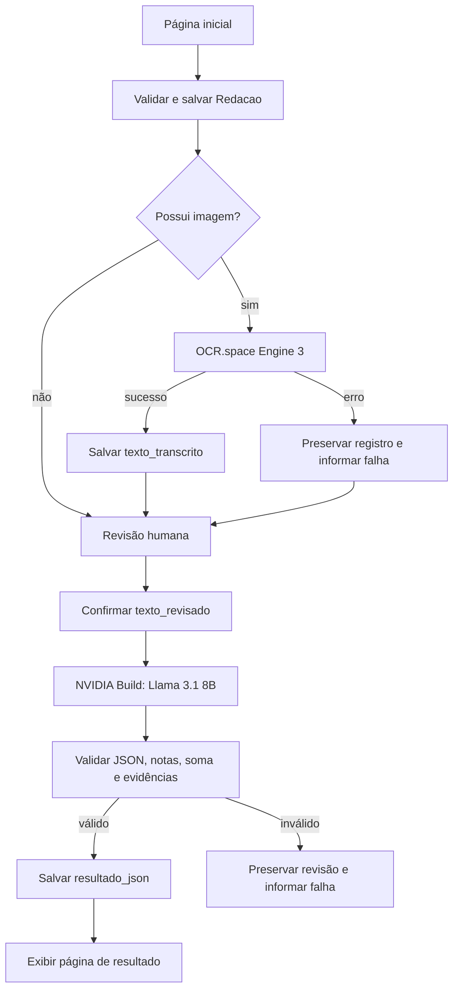

# Corretor de Redações ENEM

Protótipo Django que recebe uma redação digitada ou em imagem, extrai o texto com OCR.space, permite revisão humana e solicita à NVIDIA Build uma avaliação estruturada pelas cinco competências do ENEM.

O resultado é pedagógico e não substitui uma correção oficial do Inep.

## Funcionalidades

- envio de tema, texto e/ou imagem;
- validação de imagem de até 1 MB, compatível com o plano gratuito do OCR.space;
- OCR configurável, usando o Engine 3 por padrão;
- preservação separada do texto digitado, texto bruto do OCR e texto revisado;
- revisão humana obrigatória antes da avaliação;
- avaliação com `meta/llama-3.1-8b-instruct` pela NVIDIA Build;
- prompt protegido contra prompt injection;
- resposta JSON validada localmente antes de ser salva;
- página responsiva com nota total, competências e recomendações;
- painel administrativo e interface responsiva com Bootstrap 5;
- testes com mocks, sem consumir as APIs reais.

## Arquitetura

```text
Corretor-de-redacao-ENEM/
├── config/
│   ├── settings.py
│   └── urls.py
├── media/
├── redacoes/
│   ├── migrations/
│   ├── services/
│   │   ├── ai_service.py       # NVIDIA Build
│   │   ├── ocr_service.py      # OCR.space
│   │   └── prompt_builder.py   # prompt e validação do resultado
│   ├── templates/redacoes/
│   │   ├── inicio.html
│   │   ├── revisao.html
│   │   └── resultado.html
│   ├── admin.py
│   ├── forms.py
│   ├── models.py
│   ├── test_ai_service.py
│   ├── test_prompt_builder.py
│   ├── tests.py
│   ├── urls.py
│   ├── validators.py
│   └── views.py
├── static/
│   ├── css/app.css
│   └── js/redacao-form.js
├── templates/base.html
├── .env.example
├── manage.py
└── requirements.txt
```

As views coordenam o fluxo, mas não implementam protocolos externos. `ocr_service.py` transforma uma imagem em texto; `ai_service.py` transforma tema e redação revisada em um dicionário já validado.

## Fluxo



## Instalação

No PowerShell:

```powershell
python -m venv .venv
.\.venv\Scripts\Activate.ps1
python -m pip install --upgrade pip
pip install -r requirements.txt
Copy-Item .env.example .env
python manage.py migrate
python manage.py runserver
```

Acesse `http://127.0.0.1:8000/`.

Para o painel administrativo:

```powershell
python manage.py createsuperuser
```

Depois acesse `http://127.0.0.1:8000/admin/`.

## Configuração das APIs

Edite `.env` e substitua somente as chaves:

```env
OCR_SPACE_API_KEY=sua-chave-do-ocr-space
OCR_SPACE_API_URL=https://api.ocr.space/Parse/Image
OCR_SPACE_ENGINE=3
OCR_SPACE_LANGUAGE=auto
OCR_SPACE_TIMEOUT_SECONDS=60

NVIDIA_API_KEY=sua-chave-da-nvidia
NVIDIA_API_URL=https://integrate.api.nvidia.com/v1/chat/completions
NVIDIA_MODEL=meta/llama-3.1-8b-instruct
NVIDIA_TIMEOUT_SECONDS=120
NVIDIA_MAX_OUTPUT_TOKENS=3000
```

As chaves permanecem apenas no `.env`, que não entra no Git. Reinicie o servidor depois de alterar o arquivo.

### OCR.space

O serviço envia a imagem por `multipart/form-data`, com a chave no header `apikey`. A configuração padrão utiliza:

- Engine 3, recomendado para escrita manual;
- detecção automática do idioma;
- correção de orientação;
- ampliação interna da imagem;
- resposta sem overlay, reduzindo o JSON.

O plano gratuito aceita arquivos de até 1 MB. Imagens maiores são rejeitadas antes da chamada externa. A aplicação interpreta `OCRExitCode`, `IsErroredOnProcessing`, `FileParseExitCode` e `ParsedText`, incluindo sucessos parciais e erros informados dentro de respostas HTTP bem-sucedidas.

### NVIDIA Build

O serviço chama o endpoint OpenAI-compatible `/v1/chat/completions` por HTTPS. O modelo padrão do protótipo é `meta/llama-3.1-8b-instruct`, escolhido por apresentar menor latência e maior disponibilidade no endpoint gratuito.

A requisição usa:

- mensagem de sistema com regras prioritárias;
- prompt completo como mensagem do usuário;
- temperatura zero;
- streaming desativado;
- limite de saída de 3.000 tokens e respostas pedagógicas concisas;
- uma repetição automática somente para cota ou indisponibilidade temporária;
- timeout sem repetição, para a página não permanecer bloqueada duas vezes.

O formato JSON é exigido pelo prompt. A aplicação não confia apenas no modelo: todo resultado passa pelo validador local.

## Validação da avaliação

Uma avaliação só é salva quando cumpre todas as regras:

- JSON válido e sem Markdown;
- conjunto exato de campos;
- exatamente cinco competências, na ordem correta;
- notas somente em `0`, `40`, `80`, `120`, `160` ou `200`;
- nota total igual à soma das competências;
- competência 5 igual a zero quando há desrespeito aos direitos humanos;
- evidências existentes literalmente no texto revisado;
- avaliação impossível com motivo e notas nulas;
- campos, tipos e enumerações compatíveis com o contrato.

## Tratamento de erros

As duas integrações possuem mensagens seguras e específicas para:

- configuração ou chave ausente;
- autenticação recusada;
- cota excedida;
- timeout;
- falha de rede;
- erro HTTP;
- resposta sem JSON ou envelope inesperado;
- resposta fora do contrato local.

Detalhes internos, chaves, imagens, redações e respostas brutas não são gravados nos logs. Se uma API falhar, o registro e a revisão humana permanecem salvos.

## Testes

```powershell
python manage.py test
python manage.py check
python manage.py makemigrations --check --dry-run
```

Todos os acessos ao OCR.space e NVIDIA Build são simulados nos testes. A cobertura inclui models, forms, views, uploads, OCR, IA, prompt, validações, redirecionamentos e falhas externas.

## Privacidade

A imagem é enviada ao OCR.space e o texto revisado é enviado à NVIDIA. Para este protótipo:

- não envie nome, CPF, endereço, assinatura ou dados escolares;
- use somente redações próprias ou autorizadas;
- não registre chaves ou conteúdo sensível em logs;
- antes de uso real com estudantes, revise termos, retenção e política de privacidade dos fornecedores.

## Checklist para produção

- [ ] trocar a chave secreta do Django;
- [ ] usar `DJANGO_DEBUG=False`;
- [ ] configurar hosts, CSRF e HTTPS;
- [ ] executar `python manage.py check --deploy`;
- [ ] usar servidor WSGI/ASGI de produção;
- [ ] substituir SQLite por PostgreSQL para concorrência;
- [ ] armazenar mídia de forma privada e persistente;
- [ ] mover OCR e IA para uma fila assíncrona;
- [ ] configurar retentativas com backoff e idempotência;
- [ ] armazenar segredos em cofre;
- [ ] monitorar cotas, latência, falhas e custos;
- [ ] implementar autenticação e autorização dos usuários;
- [ ] definir retenção e exclusão das redações;

## Limitações atuais

- as chamadas externas são síncronas;
- o plano gratuito do OCR.space limita arquivos a 1 MB;
- não existe autenticação para usuários finais;
- SQLite é adequado somente ao protótipo;
- a nota é uma simulação pedagógica e pode divergir de uma avaliação humana.
